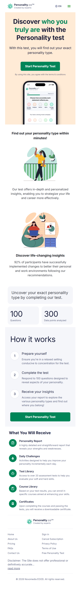
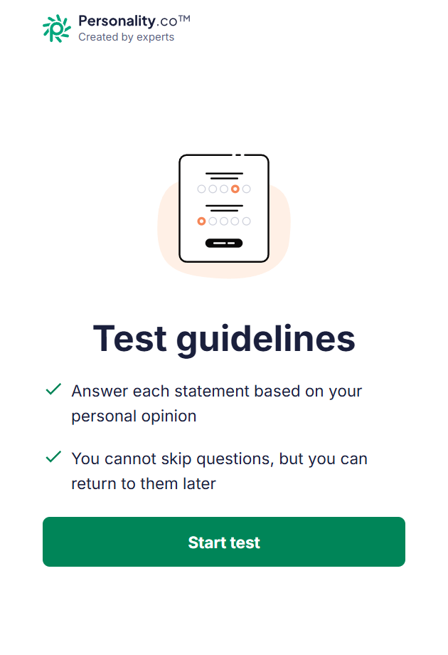
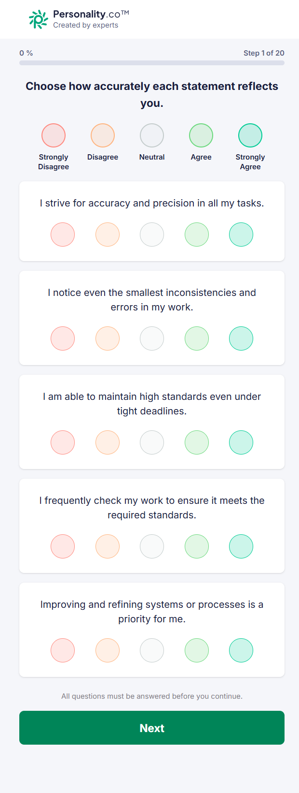
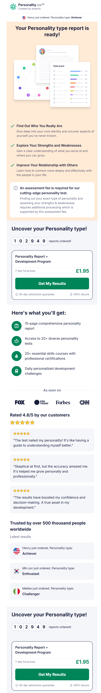
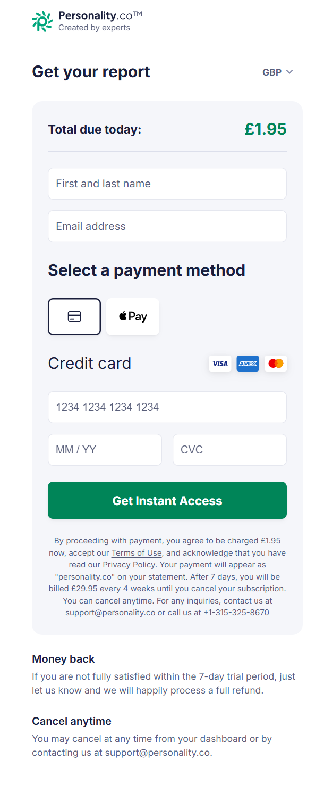
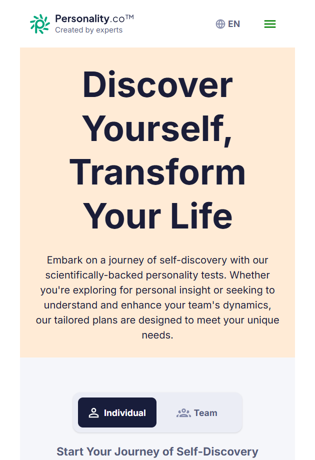

# Personality.co Deep-Dive

Audit date: 2026-04-18  
Primary domain: https://personality.co/  
Primary funnel audited: https://personality.co/test/start

## Executive summary

Personality.co appears to be a consumer-first Enneagram-style personality-test business built around a low-friction top-of-funnel and a trial-to-subscription conversion model. The core pattern is simple: let the user complete a 100-question test for free, reveal that a specific personality type has been identified, then gate the report behind a low-entry checkout offer priced at `GBP 1.95` for `7-day full access`, with renewal to `GBP 29.95 every 4 weeks` unless cancelled.

Observed fact: the product promise is broad and consumer-oriented rather than business-operational. The site repeatedly frames value around self-discovery, relationships, daily challenges, extra tests, courses, and certificates rather than workplace performance, managerial decision quality, or behavioural operating insight.

Inference: the real product is not just a one-off assessment. It is a subscription content bundle wrapped around a personality-test lead magnet.

For Sonartra, the biggest takeaway is not to copy the funnel. Personality.co is effective at mass-market conversion mechanics, but it introduces trust liabilities Sonartra should avoid: soft-science ambiguity, consumer-subscription optics, vague proof claims, and feature sprawl. Sonartra should deliberately differentiate through business relevance, methodological transparency, deterministic outputs, and premium enterprise-grade credibility.

## What Personality.co appears to be

Observed facts:

- The homepage headline is: `"Discover who you truly are with the Personality test"` ([homepage](https://personality.co/)).
- The site positions the core instrument as a personality test and the FAQ explicitly frames it as an `Enneagram` test ([FAQs](https://personality.co/faqs)).
- The site sells more than the report itself. It promises:
  - a personality report
  - daily challenges
  - a test library with `over 20 assessment tests`
  - a course library
  - certificates
- The pricing page presents both `Individual` and `Team` options, but the team offer resolves to a basic contact-sales prompt rather than a substantive team product ([pricing](https://personality.co/pricing)).

Inference:

- Personality.co is best understood as a consumer self-improvement subscription business, not a serious behavioural intelligence platform.
- The assessment serves as the acquisition hook. The monetisable asset appears to be recurring access to a broader content and testing library.
- The team positioning looks like a light expansion veneer rather than a developed B2B product.

## Public-site teardown

### Visible navigation and public pages

Observed facts:

- Top-level visible navigation on the homepage includes:
  - brand/logo: `Created by experts`
  - language selector
  - hamburger menu
- The expanded hamburger menu exposes:
  - `Home`
  - `About`
  - `Pricing`
  - `FAQs`
  - `Contact us`
  - `Sign in`
- Footer links add:
  - `Cancel Subscription`
  - `Privacy Policy`
  - `Terms of Use`
  - `Free Personality Test`

### Public landing pages and entry points

Observed facts:

- Main landing page: `https://personality.co/`
- Test entry point from homepage CTA: `Start Personality Test`
- Alternate footer test link: `https://personality.co/test/start?t=f`
- About page: `https://personality.co/about`
- Pricing page: `https://personality.co/pricing`
- FAQ page: `https://personality.co/faqs`
- Contact page: `https://personality.co/contact-us`
- Login page: `https://personality.co/login`
- Cancellation page: `https://personality.co/cancel-subscription`

### Homepage structure

Observed facts:

- Hero promise: `"Discover who you truly are with the Personality test"`
- Secondary promise: `"With this test, you will find out your exact personality type."`
- Benefit block:
  - `"Find out your personality type within minutes!"`
  - `"Our test offers in-depth and personalized insights, enabling you to strategize your life and career more effectively."`
  - `"92% of participants have successfully implemented changes..."`
- Quantification block:
  - `100 Questions`
  - `300 Data points analyzed`
- Process block:
  - `Prepare yourself`
  - `Complete the test`
  - `Receive your insights`
- Bundle block:
  - `Personality Report`
  - `Daily Challenges`
  - `Test Library`
  - `Course Library`
  - `Certificates`

Inference:

- The information architecture is thin but commercially focused. It prioritises claim, CTA, and bundle value rather than methodology or substance.
- The homepage is optimized for immediate funnel entry, not for rigorous trust-building.

### Screenshot evidence

- Homepage: 
- Test guidelines: 
- Question flow: 
- Results paywall: 
- Checkout: 
- Pricing page: 

## New-user personality test flow

### Step 1: test entry

Observed facts:

- The homepage CTA routes to `https://personality.co/test/start`.
- The first screen is a dedicated preparation screen titled `Test guidelines`.
- Pre-test instructions shown:
  - `"Answer each statement based on your personal opinion"`
  - `"You cannot skip questions, but you can return to them later"`

### Step 2: question runner

Observed facts:

- The runner advances to `https://personality.co/test/progress`.
- Progress is broken into `20` steps.
- Each step contains `5` statements, for a total of `100` items.
- The answer scale is a five-point Likert choice:
  - `Strongly Disagree`
  - `Disagree`
  - `Neutral`
  - `Agree`
  - `Strongly Agree`
- Progress indicators are explicit:
  - percent complete at top (`0%`, `5%`, `10%`, etc.)
  - step count (`Step 1 of 20`, `Step 2 of 20`, etc.)
- Guardrail copy appears on every page: `"All questions must be answered before you continue."`
- A `Sign in` button is already visible during the test flow.

Observed examples from the question bank:

- `"I strive for accuracy and precision in all my tasks."`
- `"I naturally sense when someone needs emotional support."`
- `"I enjoy solving complex problems with thorough analysis and research."`
- `"I am assertive in expressing my opinions and taking a stand."`
- `"I strive to maintain harmony in my relationships and environment."`

Inference:

- The instrument reads like a broad consumer personality inventory with strong Enneagram-style archetype cues.
- The UX is straightforward and low-cognitive-load. It does not attempt deep onboarding, context capture, or business profiling.

### Step 3: completion confirmation

Observed facts:

- After the last page, the flow lands on `https://personality.co/test/complete`.
- Completion copy:
  - `"Congratulations!"`
  - `"You've completed the personality test."`
- Options:
  - `Get My Results`
  - `Edit my answers`

### Step 4: results reveal and paywall

Observed facts:

- Clicking `Get My Results` routes to `https://personality.co/test/get-results`.
- The page simulates live analysis with loader language:
  - `"We are analysing your answers and preparing your personality type report..."`
- The page reveals a type before payment. In this audited run, the surfaced type was `Investigator`.
- Headline: `"Your Personality type report is ready!"`
- Value bullets:
  - `"Find Out Who You Really Are"`
  - `"Explore Your Strengths and Weaknesses"`
  - `"Improve Your Relationship with Others"`
- Fee justification copy:
  - `"An assessment fee is required for our cutting-edge personality test."`
  - `"Finding out your exact type of personality and assessing your strengths & weaknesses requires additional processing..."`
- Offer block:
  - `Personality Report + Development Program`
  - `7-day full access`
  - `GBP 1.95`
  - `30-day satisfaction guarantee`
  - `100% Secure`
- Social proof block:
  - `As seen on` with logo row
  - `Rated 4.8/5 by our customers`
  - testimonial quotes
  - `Trusted by over 500 thousand people worldwide`
  - live-ticker style recent orders (`James just ordered`, etc.)

Inference:

- The page is designed to create sunk-cost conversion: finish the whole test, reveal that a result exists, name the type, then sell access to the full report.
- Revealing the type pre-payment is a strong persuasion device. It confirms value without delivering the full product.

### Step 5: checkout

Observed facts:

- Checkout URL pattern: `https://personality.co/test/checkout?testId=...`
- Required inputs:
  - `First and last name`
  - `Email address`
  - payment details
- Checkout CTA: `Get Instant Access`
- Checkout disclosure:
  - `"By proceeding with payment, you agree to be charged GBP 1.95 now..."`
  - `"After 7 days, you will be billed GBP 29.95 every 4 weeks until you cancel your subscription."`
  - `"You can cancel anytime."`
- Support details are shown directly in checkout:
  - `support@personality.co`
  - `+1-315-325-8670`
- Reassurance copy:
  - `Money back`
  - `Cancel anytime`

### Blocked areas

Blocked by payment or account state:

- Post-purchase dashboard
- Full report content
- Test library depth after login
- Course library depth after login
- Certificates UX after login
- Dashboard-based cancellation path (`Membership` tab)

## Feature inventory

Observed facts:

- Core assessment:
  - 100-question personality test
  - type output
  - report access
- Subscriber bundle claims:
  - `15-page comprehensive personality report`
  - `Access to 20+ diverse personality tests`
  - `20+ essential skills courses with professional certifications`
  - `Daily personalized development challenges`
- Additional product claims from homepage/pricing/about:
  - strengths and weaknesses analysis
  - relationship insight
  - life and career strategy
  - expert guidance
  - community/resources
- Team-facing claim on pricing page:
  - `"Expand Your Team's Capabilities with More Licenses!"`
  - `Contact Sales`

Inference:

- The catalogue is breadth-led, not depth-led.
- The platform tries to improve retention with multiple repeat-use hooks: daily challenges, extra tests, courses, and certificates.
- Business utility is implied more than demonstrated.

## Conversion and monetisation analysis

### Commercial model

Observed facts:

- Entry is free up to test completion.
- First monetary ask appears only after the user has finished all 100 questions.
- Front-end offer:
  - `GBP 1.95` for `7-day full access`
- Renewal terms:
  - `GBP 29.95 every 4 weeks` on checkout
- The pricing page also lists `GBP 29.95 / month`, while checkout says `every 4 weeks`.

Inference:

- This is a low-friction tripwire offer into recurring billing.
- The model depends on high top-of-funnel volume and effective post-test conversion rather than high-trust premium positioning.

### Conversion mechanics

Observed facts:

- Core persuasion sequence:
  - promise identity insight
  - collect full test effort
  - reveal a specific type
  - gate detail behind a low entry price
  - stack bonus value around the report
  - reassure with guarantee, security, and cancel-anytime messaging
- The paywall repeats the offer block twice on the page.
- The site uses multiple social-proof devices:
  - customer rating
  - testimonials
  - media logos
  - live order ticker
  - worldwide-user count

Inference:

- The page is optimized for immediate checkout conversion rather than careful qualification.
- The repeated offer block and real-time order ticker are classic direct-response subscription patterns.

### Membership and cancellation

Observed facts:

- Dedicated public cancellation page exists: `https://personality.co/cancel-subscription`
- Cancellation page says users can cancel by:
  - entering the email used to create the account
  - logging in and using the `Membership` tab
  - contacting support

Inference:

- Personality.co expects cancellation friction to be a major user concern, serious enough to warrant a dedicated public page.
- Public visibility of cancellation is a trust repair mechanism common in trial-subscription businesses.

## Trust and credibility analysis

### Positive trust signals

Observed facts:

- Company identity is disclosed on the contact page:
  - `Novomedia EOOD`
  - `BG205083653`
  - Sofia, Bulgaria address
- Checkout includes:
  - support email
  - phone number
  - pricing disclosure
  - refund language
  - cancellation language
- Public cancellation flow exists.

### Trust tensions and contradictions

Observed facts:

- About page says:
  - `"Created by a team of experts in the field of personality research"`
  - `"validated through extensive studies"`
- Pricing page says:
  - `"scientifically-backed personality tests"`
- FAQ says the opposite in tone:
  - `"The Enneagram is a tool for self-discovery... rather than a scientific instrument."`
  - `"its validity as a psychometric tool is debated among professionals."`
- Footer disclaimer on multiple pages begins:
  - `"The Site does not offer professional or definitively accurate..."`

Inference:

- The site overreaches on scientific authority in some places, then partially walks it back in FAQ/disclaimer surfaces.
- That inconsistency weakens trust for more discerning buyers, especially business buyers.
- For Sonartra, this is the clearest example of what not to do: mix strong validation claims with broad legal hedging and soft-science ambiguity.

### Unverified trust devices

Observed facts:

- The site displays media logos (`Fox`, `USA Today`, `Forbes`, `CNN`).
- The site displays a `4.8/5` customer rating.
- The site displays `Trusted by over 500 thousand people worldwide`.
- The site displays live order-style activity (`James just ordered`, `Matteo just ordered`, etc.).

Inference:

- These devices are meant to increase conversion, but they are not self-verifying from the public pages.
- Their presence contributes to a mass-market, performance-marketing feel rather than a premium expert-platform feel.

## UX and design analysis

### Clarity

Observed facts:

- The funnel is very easy to understand.
- The test instructions are short.
- Progress is always visible.
- The commercial offer is visible and explicit by checkout.

Assessment:

- Strong on immediate clarity.
- Weak on methodological clarity.

### Persuasion

Observed facts:

- Strong CTA repetition
- pre-report type reveal
- low entry price
- guarantee messaging
- social proof density
- benefit-stacked bundle framing

Assessment:

- Highly optimized for conversion.
- Feels more like subscription marketing than a premium assessment experience.

### Friction

Observed facts:

- No account creation required before completing the test.
- No demographic or contextual onboarding observed before the test.
- Payment/account friction is deferred until maximum user investment has already occurred.

Assessment:

- Low friction before conversion.
- Friction is intentionally postponed, not removed.

### Trustworthiness

Assessment:

- Moderate for casual consumer traffic.
- Weak for premium business positioning because of science-claim inconsistency, consumer-subscription cues, and proof devices that feel marketing-heavy.

### Information architecture

Assessment:

- Thin but commercially focused.
- Good for single-funnel conversion.
- Weak for serious buyers evaluating methodology, business use cases, or report quality.

### Visual quality

Observed facts:

- The visual system is clean, light, simple, and modern enough.
- The interface uses illustrations, cards, and spacious layout.
- The brand does not feel enterprise-grade or analytically rigorous.

Assessment:

- Pleasant and usable.
- More mass-market wellness/self-help than premium behavioural intelligence.

### Premium feel vs mass-market feel

Assessment:

- Strongly mass-market.
- The presence of trials, testimonials, order tickers, certificates, and daily challenges pulls the brand away from premium strategic credibility.

## Strategic comparison with Sonartra

| Heading | Personality.co | Sonartra implication |
|---|---|---|
| Audience | Broad consumer self-discovery market | Sonartra should stay focused on leaders, teams, and business performance contexts |
| Value proposition | Know your type, improve yourself, access content bundle | Sonartra should promise behavioural intelligence that improves judgement, team effectiveness, and performance outcomes |
| Trust profile | Marketing-led, socially proofed, partially contradictory science stance | Sonartra should be method-led, transparent, and enterprise-safe |
| Assessment philosophy | Personality typing and generalized self-insight | Sonartra should emphasize behavioural signal interpretation, business application, and deterministic reporting |
| Results/report model | Type reveal + gated report + subscriber bundle | Sonartra should deliver premium, actionable, business-grade outputs rather than generic subscriber content |
| Product breadth | Many tests, courses, challenges, certificates | Sonartra should prefer depth and utility over catalogue sprawl |
| Commercial strategy | Trial-priced entry into recurring subscription | Sonartra should avoid looking like a low-trust trial-subscription funnel |
| UX tone | Friendly, consumer, self-help, conversion-oriented | Sonartra should feel serious, premium, concise, and operationally relevant |

## Key risks if Sonartra copied this model

1. Sonartra would immediately look like a generic personality-test subscription business rather than a premium behavioural intelligence platform.
2. A low-price trial plus auto-renew flow would undercut premium positioning and invite trust skepticism from business buyers.
3. Broad claims without methodological transparency would damage credibility.
4. Type-centric framing would oversimplify Sonartra's signal-based model.
5. Feature sprawl around courses, certificates, and challenge libraries would distract from Sonartra’s core engine and result contract.
6. Heavy persuasion devices could make enterprise users question rigor and seriousness.
7. A consumer self-help tone would weaken relevance for leadership, team, and performance use cases.
8. Gating insight after a long test could create resentment if the product promise is positioned as premium advisory intelligence rather than lightweight self-discovery.

## Key opportunities Sonartra can exploit

1. Differentiate on business relevance: decisions, role fit, collaboration risk, operating patterns, leadership implications.
2. Differentiate on output quality: deterministic, structured, actionable, and multi-audience like manager/team/individual.
3. Differentiate on methodological clarity: explain what is measured, how outputs are produced, and where the boundaries are.
4. Differentiate on premium trust: fewer hype claims, more precise claims.
5. Differentiate on product discipline: one flagship engine, one scoring path, one canonical result model.
6. Differentiate on enterprise visual language: authoritative, modern, restrained.
7. Differentiate on commercial integrity: clear pricing without trial-subscription tricks.
8. Differentiate on evidence: business use cases, pilot outcomes, and workplace applications rather than generic testimonials.

## 10 specific recommendations for Sonartra

1. Keep Sonartra's flagship assessment positioned as behavioural intelligence for business performance, not as a generic "discover yourself" personality experience.
2. Avoid low-entry auto-renew trial mechanics. If Sonartra charges, the commercial model should reinforce premium trust rather than look like a consumer subscription funnel.
3. Make methodological transparency a first-class asset. Explain what Sonartra measures, what it does not measure, and how the result is produced from the engine.
4. Do not lead with a single "type" reveal. Lead with a richer signal pattern, behavioural summary, and practical business implications.
5. Design the report around workplace utility: strengths, watchouts, collaboration guidance, decision tendencies, leadership implications, and development actions.
6. Keep the top-of-funnel simple like Personality.co's test runner, but use premium language and enterprise-grade framing throughout.
7. Replace mass-market trust devices with stronger proof: pilot outcomes, client scenarios, role-based use cases, and clear model explanation.
8. Resist catalogue sprawl. Sonartra should not chase retention by piling on generic tests, courses, and certificates before the core platform proves its value.
9. If Sonartra introduces team/commercial packages, make them real products with explicit workflows and value, not a thin contact-sales tab.
10. Use Personality.co as a warning about trust inconsistency: never combine strong scientific language with fallback disclaimers that quietly undercut the core claim.

## Source notes

Observed directly from:

- https://personality.co/
- https://personality.co/test/start
- https://personality.co/test/progress
- https://personality.co/test/complete
- https://personality.co/test/get-results
- https://personality.co/test/checkout
- https://personality.co/about
- https://personality.co/pricing
- https://personality.co/faqs
- https://personality.co/contact-us
- https://personality.co/login
- https://personality.co/cancel-subscription

Blocked or unverified:

- Full subscriber dashboard and report content were blocked by payment/account state.
- Cancellation from inside the authenticated dashboard was not directly verified because no paid account was created.
- Customer-rating, press-logo, user-count, and live-order authenticity were not independently verified from public sources during this audit.
